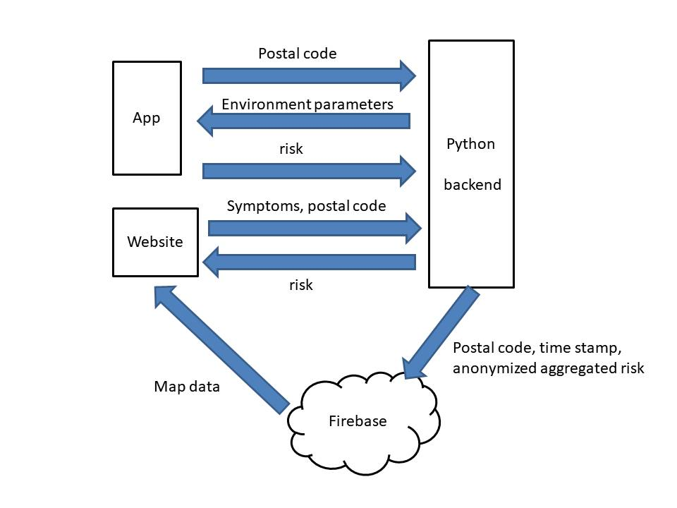

# Welcome in the Covidmap project

This app is hosted firebase.google.com. The analysis of the data is done on a local machine after getting the data from the database and then the results
are published to github. Then the frontend can use "github raw content" to make the most recent views.

- frontend: vue.js
- backend: serverless functions on firebase
- [analysis scripts](https://github.com/covidmap-sweden/analysis-scripts): python

## Data output

The analysed data are published to a repository by country ([example](https://github.com/covidmap-sweden/datasets)).

## Geocoding 

We need a geo locations file for post code for every targeted country.
One [repository](https://github.com/covidmap-sweden/geo-locations) is hosting all the geo-location data.

## Privacy Preserving Protocol
To trace contacted people, we use a privacy preserving protocol explained in [Tracing-protocol](https://github.com/covidmap-sweden/welcome/blob/master/Privacy%20preserving%20protocol.pdf).

## Privacy Legislation
[Here](https://github.com/covidmap-sweden/welcome/blob/master/Privacy%20legislation.pdf)

## Risk map
the static map is a fork from [Switzerland](https://covid-self-report.ch/). We have modified the backend and data model for Back Tracing and Aggregated Risk Evaluation functionalities using the following 
